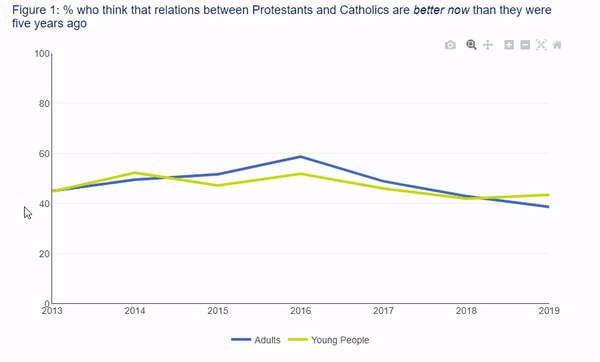
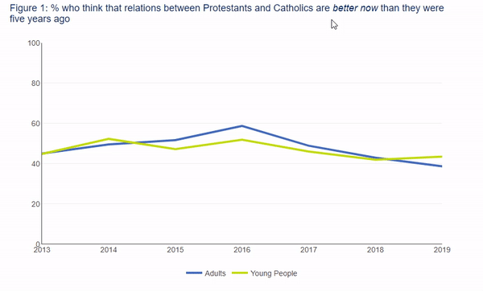
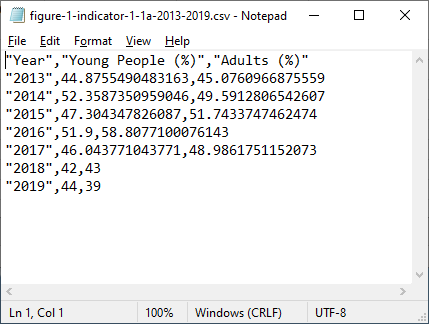

```{r setup, include=FALSE}
knitr::opts_chunk$set(echo = FALSE)

# Get the PACkage MANager library "pacman"
if(!require(pacman)) install.packages("pacman")
library(pacman)

p_load("htmltools", "dplyr", "plotly", "openxlsx", "xfun")

# Reads in all functions from functions folder
for (file in list.files(path = "functions", pattern = "*.R")) {
  source(paste0("functions/",file))
}

data <- readRDS("data/dataTo2019.RDS")

fig1 <- extractFig("f1")

```


```{r banner}

banner(leftImage = "NISRA-full-name-stacked-white.png",
       leftAlt = "NISRA logo",
       rightImage = "TEO-white-stacked.png",
       rightAlt = "Executive Office logo",
       subtitle = "Interactive Guidance")

```


## Introduction

This report includes a number of visuals that have been produced using [Plotly](https://plotly.com/r/). This document highlights some of the key features of Plotly and demonstrates how to interact with these visuals.

Taking Figure 1 as an example:

```{r, out.width = "100%"}

chartTitle(1, "% who think that relations between Protestants and Catholics are <i>better now</i> than they were five years ago")

lineChart(data = fig1,
          x = "year",
          y1 = "adults",
          y2 = "young",
          y1Name = "Adults",
          y2Name = "Young People")

```


## Hover

Hovering your mouse cursor over any part of the chart will display the figures for that particular year. On mobile this can be achieved with a single tap.

{width=100%}

## The Plotly mode bar

The controls for modifying plots are initially hidden. Hovering over a particular figure brings the Plotly mode bar into view on the top right hand corner of the visual.

{width=100%}

## Auto-scale

Most charts in this report are scaled 0%-100%. If you would like a closer look at the trend between years you can click on the Autoscale button and it will change the scale of the Y-axis.

{width=100%}

## Zoom

There are a couple of different ways to zoom in and out on the figure.

### Using Zoom in/Zoom out buttons

The Zoom in and Zoom out buttons can be used by simply clicking on them.

{width=100%}

### Using the magnifying glass

The magnifying glass allows the user to zoom in on any section of the graph they please. You first select the Zoom tool and then click and drag to draw a box on the chart and the visual will zoom to your desired region.

{width=100%}

## Panning

After zooming you can use the Pan tool to change the view without altering the level of zoom. You first select the Pan tool and then click and drag the axis along to view more data.

{width=100%}

## Selecting data

If you wish to remove an item from the chart that can be done by clicking on its legend entry. Clicking on it a second time will restore it.

{width=100%}

## Saving plot as image

Clicking the cameria icon will save the plot, in its current state, out as image file.

{width=100%}

## Resetting

You can restore the plot to its original view by clicking Reset.

{width=100%}

## Downloading the data

Under each plot there are .xlsx and .csv download buttons. Clicking on these will download the data relevant to the Figure above it.

```{r, out.width = "100%", warning = FALSE}

chartTitle(1, "% who think that relations between Protestants and Catholics are <i>better now</i> than they were five years ago")

lineChart(data = fig1,
          x = "year",
          y1 = "adults",
          y2 = "young",
          y1Name = "Adults",
          y2Name = "Young People")

downloadButtons(fig = fig1,
                indicator = "1.1a",
                headers = c("Year", "Young People (%)", "Adults (%)"))

```

### XLSX data

XLSX is the file extension for a Microsoft Excel Spreadsheet. This will download a spreadsheet that is editable and viewable in Excel. This makes the data easy to re-group, combine, and re-format.

If you don’t have Microsoft Office installed on your computer, the data will still download in a spreadsheet like the one below.

{width=100%}

### CSV data

CSV stands for Comma Separated Values, meaning data that might normally be displayed in a table or Excel sheet is removed and re-written as plain text. Here’s an example of a CSV for the same data seen above:



CSV files are commonly used for data exchange between platforms, making the data “raw” again so it can be processed by different applications. This is the most flexible data format.